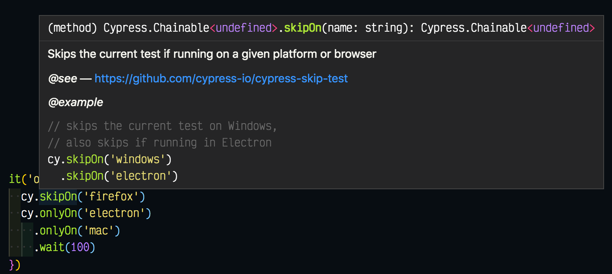

# @cypress/skip-test [![renovate-app badge][renovate-badge]][renovate-app] [![semantic-release][semantic-image] ][semantic-url] [](https://circleci.com/gh/cypress-io/cypress-skip-test/tree/master)
> Simple commands to skip a test based on platform, browser or an url

```js
it('skips this test when running on Mac', () => {
  cy.log('about to run custom command to skip this test')
    .wait(1000)
    .skipOn('mac')
})
```


## Install

```shell
npm install -D @cypress/skip-test
```

Then add this module to your support file `cypress/support/index.js`

```js
require('@cypress/skip-test')
```

## Example

### `cy.skipOn`

Skip this test if running in Electron browser

```js
it('only runs on Electron', () => {
  cy.skipOn('electron')
  // the rest of the test
})
```

Skip this test if running on Windows platform

```js
it('runs on Linux and Mac', () => {
  cy.skipOn('windows')
  // the rest of the test
})
```

### `cy.onlyOn`

Continues the test only when running on Mac, skips when running on any other platform

```js
it('runs on Mac only', () => {
  cy.onlyOn('mac')
  // the rest of the test
})
```

Continues this test only when running against `localhost`. Use `baseUrl` to set the url to compare.

```js
it('only tests localhost', () => {
  cy.onlyOn('localhost')
  // the rest of the test
})
```

### Notes

You can chain conditions together

```js
it('combination of skip and only', () => {
  cy.skipOn('firefox')
  cy.onlyOn('electron').onlyOn('mac')
  cy.log('running test')
})
```

If the test runs, it will print the conditions in the command log


## Intellisense

To get typings, reference this module, for example by using `reference` comment

```js
/// <reference types="@cypress/skip-test" />
```



For more details read [Cypress Intelligent Completion Guide](https://on.cypress.io/intellisense)

## Warning

Skipping tests in Mocha at run-time skips the `afterEach` hooks. In this example, `afterEach` will be skipped, and `after` hook will run.

```js
it('example', () => {
  cy.skipOn('mac')
})
afterEach(() => {
  // this will be skipped when a test is skipped
})
after(() => {
  // this will run even after skipping test
})
```

## Authors

- Kevin Old
- Gleb Bahmutov

[MIT License](LICENSE)

[renovate-badge]: https://img.shields.io/badge/renovate-app-blue.svg
[renovate-app]: https://renovateapp.com/
[semantic-image]: https://img.shields.io/badge/%20%20%F0%9F%93%A6%F0%9F%9A%80-semantic--release-e10079.svg
[semantic-url]: https://github.com/semantic-release/semantic-release
